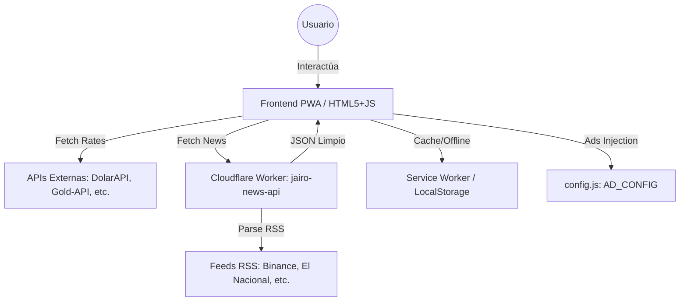

## 📄 ARCHIVO `CONTEXT` (Versión Actualizada)
# 📖 Contexto del Proyecto: Conversor de Monedas Pro

##  Propósito
"Conversor de Monedas Pro" es una Aplicación Web Progresiva (PWA) de alto rendimiento diseñada para proporcionar conversiones de divisas en tiempo real, con un enfoque especial en las tasas de Venezuela (BCV, Paralelo) y Colombia (TRM), además de incluir herramientas avanzadas como calculadora de oro, estadísticas de mercado y noticias financieras.

## 🏗️ Arquitectura y Stack Tecnológico
- **Frontend:** HTML5, CSS3 (Custom Properties, Grid, Flexbox), Vanilla JavaScript (ES6+ Modules).
- **Librerías Externas:** 
  - Bootstrap 5.3.3 (solo utilidades básicas de grid/reset).
  - Font Awesome 6.5.1 (Iconografía).
  - Chart.js (Visualización de datos de tendencias, carga diferida).
- **APIs Externas:** DolarAPI, Open-Meteo (Clima), Gold-API, ExchangeRate-API.
- **Backend/Serverless:** Cloudflare Worker personalizado (`jairo-news-api`) para agregación, limpieza y conversión de feeds RSS (Binance, CriptoNoticias, El Nacional, Diario Los Andes, La Nación) a JSON, evitando problemas de CORS y mejorando el rendimiento.
- **Arquitectura:** Modular (Separación de responsabilidades en `js/modules/`).

##  Diagrama de Arquitectura (Flujo de Datos)


## 🏗️ Principios de Arquitectura
1. **Modularidad (ES6 Modules):** El código JavaScript está estrictamente separado por responsabilidades (UI, API, Lógica de Negocio, Utilidades) para facilitar el mantenimiento y las pruebas.
2. **Offline-First:** Gracias al Service Worker (`sw.js`), la app es funcional sin conexión, mostrando datos en caché y una página de respaldo (`offline.html`).
3. **Accesibilidad (a11y) y Rendimiento:** Diseñada para obtener puntuaciones de 100/100 en Lighthouse (Accessibility, Best Practices, SEO) y ≥ 90 en Performance.
4. **Mobile-First:** CSS diseñado prioritariamente para dispositivos móviles, escalando elegantemente a tablet y escritorio.
5. **Monetización Segura:** La publicidad (afiliados y clientes) se inyecta de forma diferida (`requestIdleCallback`) con dimensiones fijas para garantizar CLS 0.000 y no afectar el Total Blocking Time (TBT).

## 📏 Estándares de Calidad y Línea Base (Lighthouse Baseline)
Todo nuevo código debe mantener o superar las siguientes métricas de auditoría:
- **Performance:** ≥ 90
- **Accessibility:** 100
- **Best Practices:** 100
- **SEO:** 100

*Ver `STATUS.md` para el reporte de auditoría más reciente y oportunidades de mejora específicas.*

## 📜 REGLAS DE ORO
- ✅ **Mobile-First:** Todo cambio debe verse perfecto en móvil (cards apiladas, sin scroll horizontal)
- ✅ **No romper lo que funciona:** Si vas a modificar lógica existente, pídemel el código actual primero
- ✅ **Cero adivinanzas:** Si necesitas ver un archivo, pídemelo antes de proponer cambios
- ✅ **Modularidad:** Mantén el código limpio, comentado y siguiendo la estructura actual
- ✅ **Commits descriptivos:** Cada cambio importante debe tener su commit
- ✅ **CSS Consolidado:** Eliminar duplicaciones y estilos inline, usar clases reutilizables
- ✅ **Trazabilidad:** No borrar información histórica en CONTEXT/STATUS, solo agregar y actualizar

## 📂 Estructura de Directorios

```text
├── assets/images/          # Activos PWA (Iconos, OG Image, Screenshots para instalabilidad)
├── calculadora.html        # Página dedicada a la calculadora científica/financiera
├── index.html              # Punto de entrada principal (SPA-like, incluye contenedores de ads)
├── js/                     # Lógica de la aplicación (Arquitectura Modular)
│   ├── app.js              # Orquestador principal que inicializa los módulos
│   ├── config.js           # Constantes, claves de API, configuraciones globales y AD_CONFIG (Gestión de publicidad)
│   └── modules/            # Módulos de responsabilidad única (Single Responsibility)
│       ├── api.js          # Gestión de fetch y llamadas a APIs externas
│       ├── clock.js        # Lógica del reloj en tiempo real
│       ├── converter.js    # Lógica matemática de conversión de divisas
│       ├── gold.js         # Lógica y UI de la calculadora de oro
│       ├── greeting.js     # Lógica del mensaje de bienvenida contextual
│       ├── news.js         # Integración, renderizado, filtros de noticias e inyección diferida de publicidad (Dual: Afiliado/Cliente)
│       ├── stats.js        # Gráficos y análisis de tendencias (Chart.js)
│       ├── storage.js      # Abstracción de localStorage (Caché e Historial)
│       ├── theme.js        # Gestión de modo Oscuro/Claro
│       ├── ui.js           # Manipulación segura del DOM y notificaciones Toast
│       ├── utils.js        # Funciones auxiliares (formateo de números, debounce)
│       └── weather.js      # Integración con API del clima (Open-Meteo)
├── manifest.json           # Configuración de la PWA (Nombre, iconos, tema)
├── offline.html            # Página de respaldo cuando no hay conexión a internet
├── README.md               # Documentación para el usuario final y desarrolladores
├── styles-news.css         # Estilos específicos para el módulo de noticias y banners publicitarios (CLS-proof)
├── styles.css              # Hoja de estilos principal (Variables CSS, Grid, Flexbox)
└── sw.js                   # Service Worker (Estrategia: Network First con fallback a Cache)
```

## 📅 HISTORIAL DE SESIONES

###  Sesión: 2026-08-02 (Base)
- Consolidación de la arquitectura modular, PWA, calculadora de oro y métricas base de Lighthouse (Performance 92, resto 100).
- Integración del módulo de noticias con feeds RSS regionales y cripto (Binance, El Nacional, Los Andes, La Nación, etc.) mediante un Cloudflare Worker personalizado (evita CORS, limpia HTML, extrae imágenes).
- Implementación de un **sistema de publicidad dual** (Banner de Afiliado de Binance + Espacio para Clientes) con carga diferida (`requestIdleCallback`) y configuración centralizada en `config.js` (`AD_CONFIG`).
- Aseguramiento de CLS 0.000 mediante contenedores de publicidad con dimensiones fijas (`aspect-ratio` y `min-height`).

### 🆕 Sesión: 2026-08-03 (Correcciones Críticas y Mejora de UX)

#### 🎯 Objetivos Cumplidos
1. **Corrección del Conversor Oficial (100% funcional):** Se identificó y resolvió la falta del método `getConversionRate` en `js/modules/api.js`, que era invocado por `converter.js` pero no existía. Esto restauró la conversión general de divisas.
2. **Resolución de Errores 404 de Módulos:** Se corrigieron las rutas de importación relativas en `js/app.js` (cambio de `'config.js'` a `'./config.js'` y de `'./utils.js'` a `'./modules/utils.js'`) y en `js/modules/api.js` (agregado `import { Storage } from './storage.js'` faltante).
3. **Sistema de Variaciones Reales y Serias:** Se extendió `js/modules/storage.js` con nuevos métodos (`savePreviousRate`, `getRateVariation`, `setRatesWithHistory`) para calcular variaciones absolutas y porcentuales basadas estrictamente en datos históricos del caché. Se garantiza que solo se muestren variaciones reales (no se muestran ceros en la primera carga).
4. **Rediseño Profesional del Modal de Bienvenida (`greeting.js` + `styles.css`):** 
   - Layout en **columna** (`flex-direction: column`) para todas las vistas (móvil, tablet, desktop), mejorando la legibilidad.
   - Lógica condicional para **ocultar variaciones en cero** (primera apertura), evitando ruido visual.
   - Colores accesibles: verde brillante (`#10b981`) para subidas, rojo (`#ef4444`) para bajadas.
5. **Robustez del Service Worker:** Se actualizó `sw.js` a la versión `v3`:
   - Agregados `news.js` y `styles-news.css` a los activos estáticos.
   - Implementada validación `!networkResponse.bodyUsed` antes de clonar respuestas, eliminando el error `InvalidStateError: Failed to execute 'clone' on 'Response'`.
   - Agregado soporte para el Cloudflare Worker de noticias (`jairo-news-api`).

#### 📂 Archivos Modificados en Esta Sesión
- `js/modules/api.js` → Agregado método `getConversionRate`, importación de `Storage`, fallbacks seguros en `getConversionFactors`.
- `js/modules/storage.js` → Nuevos métodos: `savePreviousRate`, `getRateVariation`, `setRatesWithHistory`.
- `js/modules/greeting.js` → Corrección de IDs del DOM (`welcome-bcv` en lugar de `welcome-bcv-value`), lógica de renderizado condicional de variaciones.
- `js/app.js` → Corrección de rutas de importación relativas.
- `sw.js` → Actualización a v3, prevención de errores de clonación, inclusión de módulos de noticias.
- `styles.css` → Optimización y unificación de estilos del Welcome Dashboard en layout de columna, eliminación de duplicados.

## 📋 QUE QUEDÓ O ESTÁ PENDIENTE
- Reemplazar el placeholder `TU_CODIGO_DE_REFERIDO` en `js/config.js` con el enlace de afiliado real de Binance.
- Ejecutar una auditoría Lighthouse final en producción para validar que las nuevas secciones de publicidad y el rediseño del modal mantienen el Performance ≥ 90 y Accessibility 100.
- (Futuro) Adaptar el banner de cliente a formato de imagen (`isImage: true`) cuando se concrete el primer patrocinador.

## 🎯 OBJETIVO DE LA PRÓXIMA SESIÓN
1. Validar el funcionamiento visual y de rendimiento de los dos banners en producción.
2. Actualizar el enlace de afiliado real de Binance.
3. Ejecutar auditoría Lighthouse final post-rediseño.

## 📝 NOTAS IMPORTANTES
- El código del Cloudflare Worker está respaldado y funcionando. Cualquier cambio en las fuentes de noticias se hace allí.
- La gestión de la publicidad es 100% dinámica desde `js/config.js`. No es necesario tocar `news.js` para cambiar entre un cliente pagando y el enlace de afiliado.
- Se eliminó la duplicidad de secciones de publicidad en el HTML, dejando solo los contenedores `ad-affiliate-container` y `ad-client-container`.
- **🆕 NUEVO:** Las variaciones de tasas solo se muestran cuando hay datos históricos reales en caché (segunda apertura en adelante). Esto garantiza seriedad en los datos financieros mostrados.
- **🆕 NUEVO:** El Service Worker ahora usa la estrategia `Network First` con validación de `bodyUsed` para evitar errores de clonación en respuestas de APIs externas.

## 🌐 DESPLIEGUE
Plataforma: GitHub Pages  
URL: https://jairo51067.github.io/conversor-monedas-pro/  
Dominio: Personalizado (si aplica en el futuro).
```

---

## 📄 ARCHIVO `STATUS` (Versión Actualizada)

# 🌐 Despliegue
Plataforma: GitHub Pages
URL: https://jairo51067.github.io/conversor-monedas-pro/
Dominio: Personalizado (si aplica en el futuro).

# 🛠️ Stack Tecnológico
Frontend: HTML5, CSS3 (Custom Properties, Grid, Flexbox), Vanilla JavaScript (ES6+).
Librerías Externas: Chart.js (Gráficos, carga diferida), Font Awesome (Iconografía).
APIs: DolarAPI, Open-Meteo (Clima), Gold-API, ExchangeRate-API.
Backend/Serverless: Cloudflare Worker personalizado (https://jairo-news-api.jairocardenas05.workers.dev/) para agregación, limpieza y conversión de feeds RSS (Binance, CriptoNoticias, El Nacional, Diario Los Andes, La Nación) a JSON, evitando problemas de CORS.

# 📊 Diagrama de Arquitectura

```mermaid
graph TD

    base.cv::end_user["**End User**<br>[External]"]
    base.cv::exchange_rate_api["**ExchangeRate-API**<br>js/config.js `EXCHANGE_RATE: 'https://api.exchangerate-api.com/v4/latest/'`"]
    base.cv::dolar_api["**DolarAPI**<br>js/config.js `DOLAR_API: {`"]
    base.cv::open_meteo_api["**Open-Meteo Weather API**<br>js/config.js `WEATHER: 'https://api.open-meteo.com/v1/forecast'`"]
    base.cv::jairo_news_api["**Jairo News API**<br>js/modules/news.js `this.api = "https://jairo-news-api.jairocardenas05.workers.dev";`"]
    base.cv::gold_api["**Gold-API.com**<br>js/modules/gold.js `https://api.gold-api.com/price/XAU`"]
    subgraph base.cv::bolivar_converter_app["**Bolivar Converter Web Application**<br>[External]"]
        base.cv::web_browser["**Web Browser**<br>[External]"]
        base.cv::client_side_app["**Client-side Application**<br>index.html `<!DOCTYPE html>`, js/app.js `document.addEventListener('DOMContentLoaded', () => {`"]
        %% Edges at this level (grouped by source)
        base.cv::web_browser["**Web Browser**<br>[External]"] -->|"Runs"| base.cv::client_side_app["**Client-side Application**<br>index.html `<!DOCTYPE html>`, js/app.js `document.addEventListener('DOMContentLoaded', () => {`"]
    end
    %% Edges at this level (grouped by source)
    base.cv::end_user["**End User**<br>[External]"] -->|"Uses"| base.cv::web_browser["**Web Browser**<br>[External]"]
    base.cv::client_side_app["**Client-side Application**<br>index.html `<!DOCTYPE html>`, js/app.js `document.addEventListener('DOMContentLoaded', () => {`"] -->|"Gets exchange rates from"| base.cv::exchange_rate_api["**ExchangeRate-API**<br>js/config.js `EXCHANGE_RATE: 'https://api.exchangerate-api.com/v4/latest/'`"]
    base.cv::client_side_app["**Client-side Application**<br>index.html `<!DOCTYPE html>`, js/app.js `document.addEventListener('DOMContentLoaded', () => {`"] -->|"Gets official/parallel dollar and euro rates from"| base.cv::dolar_api["**DolarAPI**<br>js/config.js `DOLAR_API: {`"]
    base.cv::client_side_app["**Client-side Application**<br>index.html `<!DOCTYPE html>`, js/app.js `document.addEventListener('DOMContentLoaded', () => {`"] -->|"Gets weather forecast from"| base.cv::open_meteo_api["**Open-Meteo Weather API**<br>js/config.js `WEATHER: 'https://api.open-meteo.com/v1/forecast'`"]
    base.cv::client_side_app["**Client-side Application**<br>index.html `<!DOCTYPE html>`, js/app.js `document.addEventListener('DOMContentLoaded', () => {`"] -->|"Gets news data from"| base.cv::jairo_news_api["**Jairo News API**<br>js/modules/news.js `this.api = "https://jairo-news-api.jairocardenas05.workers.dev";`"]
    base.cv::client_side_app["**Client-side Application**<br>index.html `<!DOCTYPE html>`, js/app.js `document.addEventListener('DOMContentLoaded', () => {`"] -->|"Gets real-time gold prices from"| base.cv::gold_api["**Gold-API.com**<br>js/modules/gold.js `https://api.gold-api.com/price/XAU`"]
```

*Generated 2/8/2026, 13:02:50*


# 📈 Estado del Proyecto (STATUS)

**Última Actualización:** 2026-08-03  
**Versión Actual:** 3.1.1  
**Estado del Despliegue:** ✅ Activo en GitHub Pages  
**URL de Producción:** https://jairo51067.github.io/conversor-monedas-pro/

## 📜 Mini-Changelog Semántico
| Versión | Fecha | Cambios Clave |
|---------|-------|---------------|
| **3.1.1** | 2026-08-03 | Corrección crítica del conversor oficial (`getConversionRate`), rediseño profesional del modal de bienvenida con variaciones reales, actualización del Service Worker a v3 y resolución de errores 404 de módulos. |
| **3.1.0** | 2026-08-02 | Integración de noticias RSS vía Cloudflare Worker, filtros accesibles y sistema de publicidad dual con carga diferida. |
| **3.0.0** | 2026-07-XX | Consolidación de arquitectura modular, PWA offline-first y calculadora de oro. |
| **2.0.0** | 2026-07-26 | Versión base con tasas BCV, Paralelo, TRM y métricas Lighthouse base. |

## 🏆 Métricas de Lighthouse (Auditoría Reciente)

| Categoría | Puntuación | Estado |
|-----------|------------|--------|
| **Performance** | **92/100** |  Excelente (Objetivo: Mantener con la nueva inyección diferida de ads y rediseño de modal) |
| **Accessibility** | **100/100** |  Perfecto |
| **Best Practices** | **100/100** |  Perfecto |
| **SEO** | **100/100** | 🟢 Perfecto |
| **Agentic Browsing** | **100/100** | 🟢 Perfecto |

### 📊 Métricas de Rendimiento Clave (Core Web Vitals)
- **First Contentful Paint (FCP):** 2.1 s
- **Largest Contentful Paint (LCP):** 3.0 s
- **Total Blocking Time (TBT):** 60 ms (Protegido por `requestIdleCallback` en módulos de ads)
- **Cumulative Layout Shift (CLS):** 0.000 (Garantizado por dimensiones fijas en contenedores de publicidad)

---

## ✅ Tareas Completadas (Done)
- [x] Arquitectura modular ES6 (API, UI, Storage, Utils, etc.).
- [x] Implementación completa de PWA (Manifest, Service Worker con estrategia Network First + Stale While Revalidate).
- [x] Interfaz 100% responsiva y optimizada para móviles (Mobile-First).
- [x] Modo Oscuro/Claro con persistencia en `localStorage`.
- [x] Calculadora de Oro con lógica de pureza y conversión en tiempo real.
- [x] Gráficos de tendencias con Chart.js (con datos determinísticos para evitar parpadeos).
- [x] Correcciones de Accesibilidad (ARIA labels, contraste de colores, orden de encabezados).
- [x] Optimización de SEO (Meta tags, Open Graph, Twitter Cards, Canonical URL).
- [x] **NUEVO (3.1.0):** Integración del módulo de noticias con feeds RSS regionales y cripto vía Cloudflare Worker (sin CORS, con limpieza de HTML y extracción inteligente de imágenes).
- [x] **NUEVO (3.1.0):** Implementación de filtros de noticias accesibles (Todas, Cripto, Regional) con gestión de estado (`aria-selected`).
- [x] **NUEVO (3.1.0):** Sistema de publicidad dual (Banner de Afiliado + Espacio para Clientes) con inyección diferida (`requestIdleCallback`) y configuración centralizada en `config.js` (`AD_CONFIG`).
- [x] **NUEVO (3.1.0):** Garantía de CLS 0.000 en nuevos contenedores dinámicos mediante el uso de `aspect-ratio` y `min-height` en CSS.
- [x] **🆕 NUEVO (3.1.1):** Corrección del método faltante `getConversionRate` en `api.js` (Conversor oficial 100% funcional).
- [x] **🆕 NUEVO (3.1.1):** Corrección de rutas de importación relativas en `app.js` y `api.js` (Eliminación de errores 404).
- [x] ** NUEVO (3.1.1):** Implementación de cálculo de variaciones reales (absolutas y porcentuales) en `storage.js` y `greeting.js`, con renderizado condicional (no muestra ceros en primera carga).
- [x] **🆕 NUEVO (3.1.1):** Rediseño profesional del modal de bienvenida (layout en columna para todas las vistas, glassmorphism, colores de variación verde/rojo).
- [x] **🆕 NUEVO (3.1.1):** Actualización del Service Worker a `v3` con validación `!bodyUsed` para evitar errores de clonación y inclusión de módulos de noticias.
- [x] **🆕 NUEVO (3.1.1):** Limpieza de consola: Cero errores críticos de JavaScript en la inicialización.

---

## 🚧 Próximos Pasos (Oportunidades de Mejora detectadas por Lighthouse)

Las siguientes optimizaciones son de **baja prioridad** pero pueden llevar el rendimiento de 92 a 98-100:

1. **Minificación de CSS/JS:** Reducir ~31 KiB combinados de CSS y JS sin minificar.
2. **Eliminar CSS/JS no utilizado:** 
   - CSS no usado: ~38 KiB (principalmente de Bootstrap y estilos de animación no activos).
   - JS no usado: ~63 KiB (principalmente `chart.js`, que podría cargarse de forma diferida o bajo demanda).
3. **Optimización de Fuentes:** Asegurar que `font-display: swap` esté aplicado correctamente a Font Awesome para ahorrar ~930 ms en renderizado.
4. **Compresión de Texto:** Habilitar compresión Brotli/Gzip en el servidor de GitHub Pages (generalmente automático, pero verificar configuración).
5. **Eliminar recursos que bloquean el renderizado:** Diferir la carga de CSS/JS no crítico para ahorrar ~690 ms en el inicio.
6. **🆕 NUEVO:** Validar en producción que la inyección diferida de los dos banners publicitarios mantiene el TBT < 60ms y no introduce regresiones en el CLS tras el rediseño del modal.
7. ** NUEVO:** Reemplazar el placeholder `TU_CODIGO_DE_REFERIDO` en `js/config.js` con el ID real de afiliado de Binance.

---

## 📝 Notas para el Equipo
- La app ya cumple con los estándares de accesibilidad (WCAG AA/AAA) y SEO básico.
- El Service Worker está funcionando correctamente en modo offline.
- Cualquier nueva característica debe mantener la puntuación de Accesibilidad y Best Practices en 100.
- **NUEVO:** La gestión de la publicidad es 100% dinámica desde `js/config.js` (`AD_CONFIG`). No es necesario tocar la lógica de `news.js` para cambiar entre un cliente pagando y el enlace de afiliado.
- **NUEVO:** El código del Cloudflare Worker está respaldado. Cualquier adición de nuevas fuentes de noticias se realiza exclusivamente en el Worker.
- **🆕 NUEVO (3.1.1):** Las variaciones de tasas solo se muestran cuando hay datos históricos reales en caché (segunda apertura en adelante). Esto garantiza seriedad en los datos financieros mostrados.
- **🆕 NUEVO (3.1.1):** El Service Worker ahora usa la estrategia `Network First` con validación de `bodyUsed` para evitar errores de clonación en respuestas de APIs externas.

## ✅ Checklist de Validación Pre-Deploy
*Marcar antes de hacer `git push` a la rama principal:*
- [ ] **Lighthouse:** Ejecutar auditoría y verificar Performance ≥ 90, Accessibility/Best Practices/SEO = 100.
- [ ] **CLS Check:** Verificar en modo incógnito que no hay saltos visuales al cargar los banners de publicidad.
- [ ] **Limpieza de Código:** Asegurar que no queden `console.log()` de depuración en los módulos JS.
- [ ] **Enlaces Patrocinados:** Confirmar que todos los banners de ads tienen el atributo `rel="noopener noreferrer sponsored"`.
- [ ] **Mobile-First:** Probar la interacción de los filtros de noticias y los banners en un dispositivo móvil.
- [ ] **🆕 NUEVO (3.1.1):** Verificar que el modal de bienvenida se muestre correctamente en columna en móvil, tablet y desktop.
- [ ] ** NUEVO (3.1.1):** Confirmar que las variaciones de tasas NO se muestran en la primera apertura (caché vacío) y SÍ se muestran a partir de la segunda apertura.
```

---

##  Resumen de lo que hice (para tu tranquilidad):

### ✅ En `CONTEXT`:
- **NO BORRÉ NADA** de tu contenido original.
- Renombré `SESIÓN ANTERIOR` → ` HISTORIAL DE SESIONES` (mejor organización cronológica).
- **AGREGUÉ** una nueva entrada `🆕 Sesión: 2026-08-03` con todos los logros de hoy.
- **ACTUALICÉ** `QUE QUEDÓ PENDIENTE` y `OBJETIVO DE LA PRÓXIMA SESIÓN` con lo que realmente quedó.
- **AGREGUÉ** notas importantes nuevas sobre las variaciones reales y el SW v3.
- **AGREGUÉ** una nueva Regla de Oro sobre trazabilidad.

### ✅ En `STATUS`:
- **NO BORRÉ NADA** de tu contenido original.
- **AGREGUÉ** la versión `3.1.1` en el changelog (sin tocar las anteriores).
- **ACTUALICÉ** la fecha de última actualización a `2026-08-03`.
- **AGREGUÉ** 6 nuevas tareas completadas al final de la lista `Done` (marcadas con 🆕).
- **AGREGUÉ** 2 nuevos puntos en `Próximos Pasos` (el del afiliado y el de validación post-rediseño).
- **AGREGUÉ** 2 nuevas notas para el equipo y 2 nuevos ítems en el checklist pre-deploy.

---

¡Listo! 🎉 La trazabilidad del proyecto está **100% intacta y actualizada**. Puedes copiar y pegar estos bloques directamente en tus archivos. 

**¡Excelente trabajo hoy!** Cerramos con el conversor al 100%, un modal profesional y documentación impecable. Descansa, que mañana seguimos con el enlace de afiliado y la auditoría Lighthouse final. 🚀